# ARX AI — Auto-Trading Bot Safety Audit

**Date:** 2026-06-19  
**Scope:** Self-Trade AI stack + Ruby AI_ASSISTED path + all shared execution gates  
**Auditor:** ARX AI agent executor (automated, evidence-backed)  
**Classification:** Confidential — operator/admin only

---

## Table of Contents

1. [Executive Summary](#1-executive-summary)
2. [System Map — Files and Modules Inspected](#2-system-map)
3. [Decision-Flow Diagram](#3-decision-flow-diagram)
4. [Complete Input Inventory](#4-complete-input-inventory)
5. [Execution Gates and Stop Points](#5-execution-gates-and-stop-points)
6. [Feed-Truth and Downgrade Points](#6-feed-truth-and-downgrade-points)
7. [Worked Examples — Takes and Skips](#7-worked-examples)
8. [Failure Modes](#8-failure-modes)
9. [Behavior-to-Test Mapping (15 Required Behaviors)](#9-behavior-to-test-mapping)
10. [Missing Tests / Gaps](#10-missing-tests--gaps)
11. [Category Scores](#11-category-scores)
12. [Readiness Classification](#12-readiness-classification)
13. [Recommended Fixes](#13-recommended-fixes)

---

## 1. Executive Summary

**Reality confirmed:** there is **no always-on autonomous loop**. The Self-Trade autonomous cycle is admin-trigger-only. `AI_AUTO_EXECUTION_ENABLED` defaults to `false` and is never set to `true` in any code path. Ruby tops out at `AI_ASSISTED`. Every auto/agent decision routes through the identical `executeInstant` → `createLiveDraft` → `confirm` → `dispatchLiveCommand` → 23-gate Phase B pipeline as a manual trade. No new MT5 path exists. No gate is bypassed.

**Key findings:**

- The bot is architected with **exceptional default-deny safety**: kill switches checked twice (entry + TOCTOU before dispatch), exactly-once via partial-unique DB index, fail-closed anomaly screens, audit written before every side effect, and a hardcoded `canPlaceLiveTrade: false` in the Risk Governor.
- **Decision intelligence is strong** for market structure (Chart Truth ≥75 required, closed-candle only, broker alignment required, feed-stale = no autonomous action) but has a documented gap: the **spread/slippage widening** scenario and the **news re-check at dispatch time** rely on downstream broker gates rather than an explicit bot-layer check.
- **Post-trade learning** is wired end-to-end: `reconcileAgentExecutions` → `ingestAgentOutcomes` → Bayesian trust updates → `evaluateEntityDrift` → feeds future AACI `learnedTrustScore`. The chain is fail-open (never blocks) and idempotent.
- **15 deterministic tests** are mapped below; 8 existed before this audit, 7 are newly added in `scripts/src/selfTradeSafetyAuditTest.ts`.

---

## 2. System Map

| Module | File | Role |
|---|---|---|
| Autonomous Cycle Orchestrator | `artifacts/api-server/src/lib/selfTrade/autonomousCycle.ts` | Admin-triggered only. Sequences decision → safety ctx → execute → reconcile/learn. |
| Decision Engine (Shadow Brain) | `artifacts/api-server/src/lib/selfTrade/decisionEngine.ts` | Read-only. Builds candidates via Ruby Market Edge + Chart Truth gate. Never dispatches. |
| Execution Gate (Context Gatherer) | `artifacts/api-server/src/lib/selfTrade/executionGate.ts` | Reads kill switches, master-live access, quota, real daily P/L. Feeds pure evaluator. |
| Execution Permission (Pure Judge) | `lib/domain/src/self-trade/executionPermission.ts` | Deterministic. 11 pre-conditions → action (EXECUTE/PREPARE_ONLY/LOG_ONLY/BLOCK). |
| Agent Executor (Dispatcher) | `artifacts/api-server/src/lib/selfTrade/agentExecutor.ts` | Turns one approved decision into a real live entry via `executeInstant`. Exactly-once. |
| Kill Switch Gate | `artifacts/api-server/src/lib/selfTrade/killSwitchGate.ts` | Read-only. GLOBAL/NEWS/AGENT/STRATEGY/SYMBOL scopes. Checked at entry AND TOCTOU. |
| AACI Advisory | `artifacts/api-server/src/lib/aaci/decisionService.ts` | Advisory only. 12-component score + hard gate. Can DEFER, PREPARE_ONLY, or reduce size. |
| AACI Reconciliation Audit | `artifacts/api-server/src/lib/aaci/reconciliationAudit.ts` | Detects lost commands / position mismatch → pauses management for safety. |
| Outcome Ingestion | `artifacts/api-server/src/lib/aaci/learning/outcomeIngestion.ts` | Bayesian trust updates from real filled/closed executions. Idempotent. Fail-open. |
| Drift Service | `artifacts/api-server/src/lib/aaci/learning/driftService.ts` | Re-evaluates trust drift per entity (agent/symbol/strategy/tf) after learning. |
| Risk Governor | `artifacts/api-server/src/lib/riskGovernor/governor.ts` | `canPlaceLiveTrade: false` hardcoded. Tracks daily P/L, symbol exposure, win rate. |
| Agent Quota Engine | `artifacts/api-server/src/lib/selfTrade/agentQuotaEngine.ts` | Daily min/base/extension trades. PROTECT/RECOVERY regimes reduce size. |
| Position Manager | `artifacts/api-server/src/lib/selfTrade/livePositionManager.ts` | L2: alerts only. L3+: MOVE_TO_BE/TIGHTEN_SL/EXIT via `executeInstant`. |
| Agent Ledger | `artifacts/api-server/src/lib/selfTrade/agentLedger.ts` | Append-only capital accounting. Realized P/L posted only from real fills. |
| Service Layer | `artifacts/api-server/src/lib/selfTrade/service.ts` | CRUD for agents, kill switches, autonomy levels. Every mutation audit-wrapped. |
| 18-Gate Phase B Dispatch | `lib/domain/src/safety-contracts/livePhaseBDispatchGate.ts` | Pure function. ALL 23 gates must PASS or dispatch is BLOCKED. |
| Synthetic Live Floor | `lib/domain/src/safety-contracts/syntheticLiveFloor.ts` | Hard floor: synthetics blocked for non-owner or non-Deriv broker. |
| Live Command Pipeline | `artifacts/api-server/src/lib/live/liveCommandPipeline.ts` | Full pipeline: preflight → draft → confirm → dispatch. 23-gate eval. |
| Symbol Feed Verdict | `artifacts/api-server/src/lib/data/symbolFeedVerdict.ts` | LIVE/LIVE_DELAYED/AWAITING. Must be LIVE for autonomous entry (entryDataSufficiency). |
| Entry Data Sufficiency | `artifacts/api-server/src/lib/live/entryDataSufficiency.ts` | Live-entry block if feed not LIVE or insufficient candles. |
| Trade Health Service | `artifacts/api-server/src/lib/tradeHealth/tradeHealthService.ts` | Read-only health report. Honest nulls on missing data — never fabricates. |
| News Risk Engine | `artifacts/api-server/src/brain/news/newsRiskEngine.ts` | Hardcoded schedule. blockTrading=true during HIGH-impact live events. |
| Ruby Self-Review | `artifacts/api-server/src/lib/rubyQuality/selfReview.ts` | Post-trade idempotent review: success/mistake tags, plain-English + admin detail. |
| Live Position Exposure | `artifacts/api-server/src/lib/live/livePositionExposure.ts` | Ghost exclusion: exposure only if `closedAt IS NULL AND reconcileState IS NULL`. |
| Feature Flags | `lib/domain/src/flags/featureFlags.types.ts` | `AI_AUTO_EXECUTION_ENABLED`: defaultEnabled=false. Never set to true. |
| AACI Types | `lib/domain/src/aaci/types.ts` | 18-system handshake registry. Advisory authority order documented. |
| Profiles | `artifacts/api-server/src/lib/selfTrade/profiles.ts` | 5 templates (ALPHA/BLAZE/ATLAS/NOVA/TITAN). Seeds only — runtime gates override. |

---

## 3. Decision-Flow Diagram

```mermaid
flowchart TD
    A[Admin triggers runAutonomousCycle] --> AA[writeSelfTradeAudit AUTONOMOUS_CYCLE_RUN\nFAIL-CLOSED: abort if audit fails]
    AA --> B[runDecisionCycle]

    subgraph SHADOW_BRAIN [Decision Engine — READ-ONLY, never dispatches]
        B --> C[Load ACTIVE/FUNDED_IDLE agents + their allowedSymbols]
        C --> D[For each agent × symbol:\nbuildRubyMarketEdgeForUser M5 + H1]
        D --> E{Chart Truth Gate\n≥75 score?\nFeed LIVE?\nBroker aligned?\nCandle closed?}
        E -- NO --> F[Inject CHART_TRUTH_BLOCKED\ninto handshake.blocked]
        E -- YES --> G[chartGateAllowed = true]
        F --> H[runDecisionPipeline\nwith degraded handshake]
        G --> H
        H --> I[Resolve symbol contention\nhigher autonomyLevel wins]
        I --> J[Persist decisions to selfTradeDecisionsTable\nfail-open on persist]
    end

    J --> K[buildFleetSafetyContext\nGovernor + Handshake — built once]

    K --> L{Operational mode\nPHASE-7 check}
    L -- LOCKDOWN/INCIDENT → pauseAutonomousEntries=true --> M[BLOCKED — write AUTONOMOUS_ENTRIES_PAUSED audit\nProtective actions still run]
    L -- NORMAL --> N[Load approved decisions for cycle]

    N --> O[For each APPROVED/APPROVED_REDUCED/PREPARE_ONLY decision]

    O --> P{evaluateTradeAnomalyForUser\nPre-execution anomaly screen}
    P -- BLOCK or unevaluable --> Q[BLOCKED + TRADE_COMMAND_ANOMALY_BLOCK audit\nFAIL-SAFE: unevaluable = hold]
    P -- ALLOW --> R[evaluateAgentExecution]

    subgraph EXEC_GATE [Execution Gate — READ-ONLY]
        R --> R1[Kill switch check\nGLOBAL/NEWS/AGENT/STRATEGY/SYMBOL]
        R1 --> R2[Master-live access check\nloadAndEvaluateUserMasterLiveAccessGate]
        R2 --> R3[Compute real daily P/L\nCLOSED realizedPnl + FILLED floating\nghost positions excluded]
        R3 --> R4[Count quota: tradesTakenToday\nfrom real FILLED/CLOSED rows only]
        R4 --> R5[evaluateExecutionPermission PURE\n11 pre-conditions in priority order]
    end

    R5 -- BLOCK / LOG_ONLY --> S[Audit + return blocked status]
    R5 -- PREPARE_ONLY or EXECUTE --> T[AACI Advisory\nevaluateAaciExecutionAdvisory]

    T -- DEFER --> U[EXECUTION_AACI_DEFERRED audit]
    T -- PROCEED / downgradeToPrepareOnly --> V[Resolve entry price\nthesis midpoint OR routeQuote\nNO_ENTRY_PRICE if neither available]

    V --> W[computeRiskAwareLot\nstopLoss REQUIRED\nno SL = NO_PROTECTIVE_STOP = cannotSize = BLOCKED]
    W -- cannotSize --> X[BLOCKED — no dispatch]
    W -- sized --> Y[Insert PENDING_TICKET row\nidempotencyKey=decision:id\npartial-unique index = exactly-once]

    Y --> Z{TOCTOU: assertAgentNotKilled\nRE-CHECK kill switch immediately before dispatch}
    Z -- killed --> AA2[Update row to BLOCKED\nEXECUTION_BLOCKED_TOCTOU audit]
    Z -- not killed --> AB[writeAudit EXECUTION_DISPATCH_INTENT before dispatch]

    AB --> AC[executeInstant userId=executingUserId\nSource: self_trade]
    AC --> AD[createLiveDraft preflight\nARXFocus check, SL/TP sanity, pool gates,\nbroker symbol rules, feed verdict]
    AD --> AE[confirmLiveDraft]
    AE --> AF[dispatchLiveCommand\n23-gate Phase B evaluator\nALL 18 must PASS]

    AF -- PASS all 18 --> AG[SENT_TO_MT5_LIVE → EA bridge]
    AF -- ANY gate FAIL --> AH[LIVE_BLOCKED primaryReason]

    AG --> AI[EA executes → LIVE_FILLED + brokerTicket\nOR LIVE_REJECTED / LIVE_FAILED / LIVE_EXPIRED]

    AI --> AJ[reconcileAgentExecutions\nDispatch ≠ fill: FILLED only on real brokerTicket]
    AJ --> AK[reconcileAaciChain\nAnomaly → shouldPauseManagement]
    AK --> AL[manageAgentPositions\nL2=alerts only / L3+=MOVE_TO_BE/TIGHTEN_SL/EXIT]
    AL --> AM[applyRealizedFromFills\nPnL from real open+close fill prices only]
    AM --> AN[ingestAgentOutcomes → Bayesian trust\nevaluateEntityDrift → AACI learnedTrustScore]
```

---

## 4. Complete Input Inventory

Every input the bot reads before proposing or placing a trade:

### Market Signals
| Input | Source Module | File |
|---|---|---|
| Ruby Market Edge signal (M5 primary) | `buildRubyMarketEdgeForUser` | `signalIntelligenceService.ts` |
| Ruby Market Edge signal (H1 HTF alignment) | `buildRubyMarketEdgeForUser` | `signalIntelligenceService.ts` |
| Chart Truth score (≥75 required) | `getCachedIntelligenceContext` | `chartIntelligence.ts` |
| Feed freshness / selfTradeChartAllowed | `gateOutput.selfTradeChartAllowed` | `chartIntelligence.ts` |
| autonomousChartActionAllowed (stale guard) | `gateOutput.autonomousChartActionAllowed` | `chartIntelligence.ts` |
| Broker price alignment | `gateOutput.tradeConfirmationAllowed` | `chartIntelligence.ts` |
| Current candle closed check | `cached.state.currentCandle === null` | `chartIntelligence.ts` |
| Live quote (bid/ask/last) | `routeQuote(symbol)` | `marketDataRouter.ts` |
| News safety score → news risk level | `signal.scores.newsSafety` via `deriveNewsRisk` | `decisionEngine.ts` → `newsRiskEngine.ts` |
| Symbol feed verdict (LIVE/LIVE_DELAYED/AWAITING) | `resolveSymbolFeedVerdictForSymbol` | `symbolFeedVerdictForSymbol.ts` |

### Agent / Fleet State
| Input | Source |
|---|---|
| Agent status (must be ACTIVE) | `selfTradeAgentsTable` |
| Agent mode (SHADOW=LOG_ONLY, LIVE=execute path) | `selfTradeAgentsTable` |
| Agent autonomy level (L0=log, L1=prepare, L2+=execute) | `selfTradeAgentsTable` |
| Agent funding (allocatedFunds > 0) | `selfTradeAgentLedgerTable` |
| Allowed symbols list | `selfTradeAgentSettingsTable.allowedSymbols` |
| Allowed strategies list | `selfTradeAgentSettingsTable.allowedStrategies` |
| News trading permission (BLOCK/CAUTION/ALLOW) | `selfTradeAgentSettingsTable.newsTradingPermission` |
| Risk per trade % | `selfTradeAgentSettingsTable.riskPerTradePct` |
| Max lot per trade | `selfTradeAgentSettingsTable.maxLotPerTrade` |
| Max concurrent positions | `selfTradeAgentSettingsTable.maxConcurrentPositions` |
| Daily loss cap (USD) | `selfTradeAgentSettingsTable.maxDailyLossUsd` |
| Daily profit goal (USD) | `selfTradeAgentSettingsTable.dailyProfitGoalUsd` |
| Daily/base/extension trade quotas | `selfTradeAgentSettingsTable` (dailyMinTrades, baseMaxTrades, extensionMaxTrades) |

### Risk / Exposure State
| Input | Source |
|---|---|
| Real daily P/L (realized + floating) | `computeAgentDailyPnlUsd` from `selfTradeAgentExecutionsTable` + `arxLivePositionsTable` |
| Open concurrent positions | `arxLivePositionsTable` filtered by `openLiveExposureCondition` (ghost-excluded) |
| Trades taken today | `countAgentFilledTradesToday` (FILLED/CLOSED rows only) |
| Risk Governor status | `evaluateGovernor` → `riskGovernorEvaluationsTable` |
| Risk Governor hard blocks | `GovernorContext.hardBlocks` |
| Handshake readiness network | `runAllHandshakes` → coordinator |
| Kill switch state | `selfTradeKillSwitchesTable` (all engaged scopes) |
| Operational mode (LOCKDOWN/INCIDENT pauses entries) | `getOperationalMode` |
| Trade anomaly screen | `evaluateTradeAnomalyForUser` (lot vs baseline, repeated attempts) |
| AACI advisory (cohesion/freshness/trust) | `evaluateAaciExecutionAdvisory` |

### Execution Identity / Bridge State
| Input | Source |
|---|---|
| Executing user ID | `agent.ownerId ?? agent.createdByUserId` |
| Master-live access | `loadAndEvaluateUserMasterLiveAccessGate` |
| User armed for live | `getMyArming` → `arxLiveUserArmingTable` |
| User kill switch | `arxLiveUserArmingTable.killSwitchEngaged` |
| EA heartbeat age | `mt5ConnectionTable.lastHeartbeatAt` |
| EA version | `mt5ConnectionTable.eaVersion` |
| EA flags (EnableLiveExecution, ReadOnlyMode, algoTradingAllowed) | `mt5ConnectionTable` |
| Bridge account type (live/real/demo) | `mt5ConnectionTable.accountType` |
| Per-user daily realised loss | `realisedDailyLossUsd` from `arxLiveCommandsTable` |
| Broker symbol spec | `getBrokerSymbolSpec` → `mt5BrokerSymbolsTable` |
| Shared pool allocation view | `getUserAllocationView` → `userSlotAllocationTable` |
| Risk disclosure accepted | `liveRiskDisclosureAcceptancesTable` |

---

## 5. Execution Gates and Stop Points

### Layer 0 — Autonomous Cycle Entry (pre-dispatch)
| Stop Point | Code | Location |
|---|---|---|
| Audit insert failure aborts the whole run | `writeSelfTradeAudit` throws → cycle does not proceed | `autonomousCycle.ts:73` |
| Operational mode LOCKDOWN/INCIDENT pauses new entries | `entriesPaused = opMode.posture.pauseAutonomousEntries` | `autonomousCycle.ts:114` |
| Anomaly screen: lot far above baseline, agent not permitted, repeated attempts | `evaluateTradeAnomalyForUser` → BLOCK | `autonomousCycle.ts:168` |
| Anomaly screen unevaluable → fail-safe BLOCK | `catch → BLOCKED + audit` | `autonomousCycle.ts:198` |

### Layer 1 — Execution Gate / Pure Evaluator (priority order)
| # | Condition | Block Code | File |
|---|---|---|---|
| 1 | Kill switch engaged (any scope) | `KILL_SWITCH_ENGAGED` | `executionPermission.ts:90` |
| 2 | Agent not ACTIVE | `AGENT_NOT_ACTIVE` | `executionPermission.ts:93` |
| 3 | Agent unfunded (allocatedFunds ≤ 0) | `AGENT_UNFUNDED` | `executionPermission.ts:96` |
| 4 | Decision outcome not APPROVED/APPROVED_REDUCED/PREPARE_ONLY | `OUTCOME_NOT_APPROVED` | `executionPermission.ts:99` |
| 5 | Governor LOCKED | `GOVERNOR_LOCKED` | `executionPermission.ts:102` |
| 6 | Governor has hard blocks | `GOVERNOR_HARD_BLOCK` | `executionPermission.ts:105` |
| 7 | Handshake blocked | `HANDSHAKE_BLOCKED` | `executionPermission.ts:108` |
| 8 | Setup window expired | `SETUP_EXPIRED` | `executionPermission.ts:111` |
| 9 | Daily quota hard cap reached | `QUOTA_HARD_CAP` | `executionPermission.ts:114` |
| 10 | Concurrent positions ≥ max | `MAX_CONCURRENT_POSITIONS` | `executionPermission.ts:117` |
| 11 | No thesis (no stop-loss / no edge) | `NO_THESIS` | `executionPermission.ts:126` |
| — | SHADOW mode → LOG_ONLY | action=LOG_ONLY, permitted=false | `executionPermission.ts:132` |
| — | Autonomy L0 → LOG_ONLY | action=LOG_ONLY, permitted=false | `executionPermission.ts:144` |
| 12 | No executing user resolved | `NO_EXECUTING_USER` | `executionPermission.ts:159` |
| 13 | No master-live access | `NO_MASTER_LIVE_ACCESS` | `executionPermission.ts:162` |
| — | Autonomy L1 or PREPARE_ONLY outcome | action=PREPARE_ONLY (human confirm required) | `executionPermission.ts:171` |

### Layer 2 — Agent Executor (post-permit, pre-dispatch)
| Stop Point | Description | File |
|---|---|---|
| AACI advisory DEFER | Cohesion/trust below threshold → no dispatch | `agentExecutor.ts:203` |
| AACI downgradeToPrepareOnly | Cohesion weak → stage draft, no autonomous dispatch | `agentExecutor.ts:328` |
| No entry price | Thesis midpoint null AND routeQuote returned null | `agentExecutor.ts:243` |
| Non-forex symbol (no contract spec) | `valuePerUnitPerLotFor` returns null for non-6-letter | `agentExecutor.ts:249` |
| Lot sizing fails (NO_PROTECTIVE_STOP / NO_STOP_DISTANCE) | `computeRiskAwareLot.cannotSize = true` | `agentExecutor.ts:267` |
| Duplicate execution (exactly-once) | Partial-unique index on `idempotencyKey` active states | `agentExecutor.ts:297` |
| **TOCTOU kill switch re-check** | Re-reads DB immediately before `executeInstant` call | `agentExecutor.ts:306` |

### Layer 3 — executeInstant preflight (liveCommandPipeline)
| Stop Point | Description |
|---|---|
| User not armed | `arming.isArmed = false` → `USER_NOT_ARMED_FOR_LIVE` |
| Kill switch | `arming.killSwitchEngaged` → `KILL_SWITCH_ENGAGED` |
| Pool not recomputable | `LIVE_BLOCKED:MASTER_BRIDGE_NOT_PINNED/SNAPSHOT_MISSING/STALE` |
| Allocation frozen | `userSlotAllocationTable.allocationStatus = frozen` |
| Shared live paused | `pool.sharedLivePaused` → `LIVE_BLOCKED:SHARED_LIVE_PAUSED` |
| Pool over-allocated | `pool.isOverAllocated` → `LIVE_BLOCKED:POOL_OVER_ALLOCATED` |
| User allocation exhausted | `view.availableAllocation ≤ 0` |
| Entry data insufficient | `evaluateEntryDataSufficiency` — feed not LIVE or not enough candles |
| ARX Focus market check | `isApprovedArxMarket` — symbol must be in the 36-market ARX focus list |
| Synthetic live floor | `evaluateSyntheticLiveFloor` — hard block for non-owner/non-Deriv |
| Broker symbol rules | `evaluatePreTradeBrokerGuard` — min/max volume, freeze distance, SL/TP proximity |

### Layer 4 — 18-Gate Phase B Dispatch Evaluator (pure, all must PASS)
| Gate # | Key | What it checks |
|---|---|---|
| 1 | `LIVE_BROKER_EXECUTION_DISABLED` | env master switch |
| 2 | `USER_NOT_ARMED_FOR_LIVE` | per-user arming row |
| 3 | `USER_NOT_LIVE_APPROVED` | admin per-user approval |
| 4 | `GLOBAL_LIVE_DISABLED` | singleton global flag |
| 5 | `KILL_SWITCH_ENGAGED` | per-user kill switch (re-check #3) |
| 6 | `BRIDGE_NOT_LIVE_ACCOUNT` | accountType = live/real |
| 7 | `EA_HEARTBEAT_STALE` | age ≤ 15s |
| 8 | `EA_VERSION_TOO_OLD` | EA ≥ v1.27 |
| 9 | `EA_ENABLE_LIVE_EXECUTION_FALSE` | EA input toggle |
| 10 | `EA_READ_ONLY_MODE_TRUE` | EA input toggle |
| 11 | `EA_TERMINAL_NOT_CONNECTED` | EA terminal connected |
| 12 | `EA_ALGO_TRADING_NOT_ALLOWED` | MT5 algo trading |
| 13 | `SYMBOL_NOT_ALLOWED` | user allowedSymbols |
| 14 | `VOLUME_EXCEEDS_MAX_LIVE_LOT` | per-symbol max lot |
| 15 | `DAILY_LOSS_LIMIT_REACHED` | realised loss today ≥ cap |
| 16 | `MISSING_STOP_LOSS` | SL required (with admin override) |
| 17 | `MISSING_TAKE_PROFIT` | TP required (governance-conditional) |
| 18 | `DISCLOSURE_NOT_ACCEPTED` | risk disclosure accepted |

---

## 6. Feed-Truth and Downgrade Points

Feed confidence can **only downgrade, never grant** execution:

| Feed State | Decision Engine Effect | Execution Effect |
|---|---|---|
| `AWAITING` | `CHART_TRUTH_BLOCKED` injected into `handshake.blocked` → HANDSHAKE_BLOCKED | `entryDataSufficiency` blocks draft |
| `LIVE_DELAYED` | Same — autonomous action withheld on stale feed | Preflight blocks with `INSUFFICIENT_DATA_FOR_ENTRY` |
| `LIVE` + Chart Truth < 75 | `selfTradeChartAllowed = false` → CHART_TRUTH_BLOCKED | Independent of feed verdict |
| `LIVE` + feed stale (`autonomousChartActionAllowed=false`) | `CHART_TRUTH_BLOCKED` injected | Blocks autonomous confirmation |
| `LIVE` + broker alignment degraded | `tradeConfirmationAllowed=false` → CHART_TRUTH_BLOCKED | Blocks entry/stop reference |
| `LIVE` + forming candle (currentCandle ≠ null) | `CHART_TRUTH_BLOCKED` — bars must be closed | Prevents confirmation on forming bar |
| News risk CRITICAL | `newsRisk = "critical"` in thesis → `runDecisionPipeline` downgrades | Agent `newsTradingPermission=BLOCK` stops entry |
| Historical-only (no live tick) | Feed = AWAITING → CHART_TRUTH_BLOCKED | `entryDataSufficiency` blocks |
| AACI score < 60 | `recommendedAction = WATCH_ONLY` → executor defers | No dispatch |
| AACI score 60–69 | `recommendedAction = PREPARE_ONLY` → downgrade to prepare-only | Draft staged, human confirm required |
| AACI score 70–79 | `recommendedAction = ALLOW_REDUCED_SIZE` → sizeMultiplier applied | Smaller lot |
| Quota PROTECT regime | `sizeMultiplier = 0.5` + `requireExtraConfirmation = true` | Smaller position |
| Quota RECOVERY regime | `sizeMultiplier = 0.7` + `requireExtraConfirmation = true` | Reduced position |
| Position mismatch detected | `reconcileAaciChain → shouldPauseManagement = true` | Position management paused |

---

## 7. Worked Examples

### 7a. Trade the bot TAKES

**Scenario: EURUSD trending bullish, clean feed, all gates green**

Pre-conditions:
- Chart Truth score = 82, feed = LIVE, broker aligned, previous candle closed
- Ruby M5 signal: directional BUY, confidence = 78, news safety = 90
- Agent: ALPHA profile, LIVE mode, autonomy L2, 1 position open (max=2)
- Kill switch: not engaged. Governor: PAPER_ALLOWED. Handshake: ready.
- AACI advisory score: 83 → `ALLOW`, sizeMultiplier = 1
- Lot computed: 0.03 lots from $150 risk budget, 50-pip stop, within agent max 0.05

Decision flow: `APPROVED` → Execution gate: `EXECUTE` → AACI: proceed → entry price from thesis midpoint → lot sized → PENDING_TICKET inserted → TOCTOU pass → dispatch intent audited → `executeInstant` → draft created → confirmed → 23-gate PASS → `SENT_TO_MT5_LIVE`.

### 7b. Trade the bot CORRECTLY SKIPS

**Case 1: Historical-only feed**

Chart intelligence has no live tick. `autonomousChartActionAllowed = false`. Decision engine injects `CHART_TRUTH_BLOCKED` into handshake. `evaluateExecutionPermission` returns `HANDSHAKE_BLOCKED`. Result: **BLOCKED, no dispatch.** Additionally, `entryDataSufficiency` independently blocks at the preflight layer.

**Case 2: Low chart confidence + conditional scalp only**

Chart Truth score = 65 (below 75). `selfTradeChartAllowed = false` → `CHART_TRUTH_BLOCKED` injected into handshake.blocked. Execution permission: `HANDSHAKE_BLOCKED`. Result: **BLOCKED.**

**Case 3: Missing news/event-risk provider**

If `newsRiskEngine` returns a hardcoded event window as HIGH and the agent's `newsTradingPermission = BLOCK`: the decision pipeline receives `newsRisk = "high"` in the candidate, the pure pipeline downgrades the decision to `WATCH_ONLY`. Decision persisted but not executable. Result: **not dispatched.** Note: news risk engine has a hardcoded schedule — it doesn't require a connected external provider for its schedule. An external calendar is used for enrichment only. Gap documented in Section 10.

**Case 4: Stacked same-direction exposure**

Agent has `maxConcurrentPositions = 2`, open positions = 2. `evaluateExecutionPermission`: `MAX_CONCURRENT_POSITIONS`. Result: **BLOCKED.** Even if AACI advisory would allow, the pre-gate runs first.

**Case 5: Stale bridge heartbeat**

At Phase B dispatch, gate #7 `EA_HEARTBEAT_STALE` checks heartbeat age > 15s. Even if the decision engine produced an APPROVED candidate, the 23-gate evaluator returns `BLOCKED:EA_HEARTBEAT_STALE`. Result: **BLOCKED at dispatch.** Execution gets `res.ok = false`, execution row updated to BLOCKED.

**Case 6: Unsafe margin / daily loss cap reached**

Agent's real daily P/L crosses `maxDailyLossUsd`. Quota pressure regime becomes `PROTECT` (sizeMultiplier = 0.5, requireExtraConfirmation = true). If the loss reaches the Phase B gate #15 threshold (`realisedDailyLossUsd >= dailyLossLimitUsd`), Phase B dispatch returns `BLOCKED:DAILY_LOSS_LIMIT_REACHED`. Double protection: agent-layer quota pressure AND Phase B gate.

**Case 7: Display-only "Ready now" — cannot execute**

The CI guard `check-display-contract-import-boundary.ts` asserts `artifacts/api-server/src/lib/selfTrade` never imports `displayContract`, `readabilityOnly`, `mayShow*`, or `canShowTradeSetup`. A display-only "Ready now" indicator from `marketDataSufficiency.ts` is physically fenced from the execution path. Result: **architecturally impossible to execute from display confidence alone.**

**Case 8: Missing stop-loss**

`computeRiskAwareLot` receives `stopLossPrice = null`. Returns `cannotSize = true, reasonCode = "NO_PROTECTIVE_STOP"`. Executor returns `BLOCKED:NON_POSITIVE_LOT`. Additionally, Phase B gate #16 `MISSING_STOP_LOSS` fires at dispatch. Result: **BLOCKED at two independent layers.**

**Case 9: Owner/admin live path — broker truth not bypassed**

Even for the owner with `isOwnerUnrestricted = true`: the 23-gate Phase B evaluator runs in full. Gates #6 (account type live/real), #7 (heartbeat fresh), #9/#10 (EA flags) still evaluate real broker state. The unrestricted profile only relaxes the *app-layer* margin proxy and lot/symbol caps — never the broker-side gates or the live command pipeline. The autonomy system still requires `hasMasterLiveAccess = true` resolved from `loadAndEvaluateUserMasterLiveAccessGate`.

---

## 8. Failure Modes

| Failure Mode | Current Handling | Residual Risk |
|---|---|---|
| Kill switch disengaged mid-cycle (TOCTOU) | Re-checked immediately before `executeInstant` call | Low — 2-check window is milliseconds; the DB read + update is atomic at the execution row |
| Duplicate command from retry | Partial-unique index on `(agentId, idempotencyKey)` in active states → `SKIPPED_DUPLICATE` | Low — index is enforced at DB level |
| Anomaly service crashes | Fail-safe: catch → BLOCKED, audit written | Low — defaults to the safe outcome |
| AACI service unavailable | Fail-open to `prepare-only` downgrade (never waves through) | Low — fails conservatively |
| Ghost positions inflate P/L or position count | `openLiveExposureCondition` excludes `reconcile_state IS NOT NULL` | Low — CI guard `check-reconciled-ghost-exposure.ts` locks this |
| Position mismatch (broker vs app) | `reconcileAaciChain` detects → pauses management | Low — no auto-close on mismatch |
| Stale EA heartbeat not detected | Phase B gate #7 hard-blocks at 15s threshold | Low — independently enforced at dispatch |
| Spread widens after decision | Decision engine passes `liveSpreadPoints: null` at decision time; EA applies broker SetDeviationInPoints cap and deviation check | **Medium** — no bot-layer spread re-check at dispatch. Documented in Section 10. |
| News provider disconnected | newsRiskEngine uses hardcoded schedule — never blocks for "missing provider" | Low for scheduled events. **Medium** for real-time unscheduled events (no live calendar provider). Documented in Section 10. |
| Learning loop corrupts trust scores | `ingestAgentOutcomes` is idempotent + fail-open. Drift is advisory-only, never an execution gate | Low — learning never blocks |
| Realized P/L fabricated | P/L only computed from real `fillPrice` on `LIVE_FILLED` commands + real `arxLivePositions` | Low — `isRealizedPnlIngestible` guards |
| Agent activated without funds | `setAgentStatus` to ACTIVE checks `availableFunds > 0` AND `allocatedFunds > 0` inside a DB transaction | Low — double check: status machine + ledger |
| Admin bypasses AACI handshake to release kill switch | Handshake `DISABLE_KILL_SWITCH` is advisory. Kill switch release requires explicit OWNER/ADMIN action + reason + audit | Medium — AACI can't prevent it; audit trail is the control |

---

## 9. Behavior-to-Test Mapping (15 Required Behaviors)

| # | Behavior | Test File | Test Name / Coverage | Status |
|---|---|---|---|---|
| B1 | Skip on historical-only / non-LIVE feed | `scripts/src/selfTradeExecutionDomainTest.ts` | `handshake blocked ⇒ BLOCK` (HANDSHAKE_BLOCKED covers the CHART_TRUTH_BLOCKED path) | **Existing** |
| B1x | Feed-level block (evaluateLivePhaseBDispatchGate) | `scripts/src/selfTradeSafetyAuditTest.ts` | `Phase B: stale heartbeat → EA_HEARTBEAT_STALE` | **NEW** |
| B2 | Simulated / insufficient data never reaches executable decision; live feed required | `scripts/src/selfTradeSafetyAuditTest.ts` | `SIMULATOR→BLOCKED; hasSufficientData=false→WATCH_ONLY; STALE→not APPROVED; live→data_feed PASS` (via `runDecisionPipeline`) | **NEW** |
| B3 | Missing news provider → pipeline passes news check; HIGH/CRITICAL risk produces WAIT/reduced outcome | `scripts/src/selfTradeSafetyAuditTest.ts` | `newsRisk=none→PASS; low→PASS; high→WARN; critical→FAIL` (via `runDecisionPipeline` step 14); WATCH_ONLY/DENIED→OUTCOME_NOT_APPROVED | **NEW** |
| B4 | Reduce/skip on stacked exposure | `scripts/src/selfTradeExecutionDomainTest.ts` | `max concurrent ⇒ BLOCK` | **Existing** |
| B5 | Skip on stale bridge heartbeat (Phase B gate) | `scripts/src/selfTradeSafetyAuditTest.ts` | `Phase B: stale heartbeat → EA_HEARTBEAT_STALE` | **NEW** |
| B6 | Skip on unsafe margin / daily loss cap | `scripts/src/selfTradeSafetyAuditTest.ts` | `Phase B: daily loss limit reached → DAILY_LOSS_LIMIT_REACHED` | **NEW** |
| B6b | Quota pressure PROTECT regime | `scripts/src/selfTradeExecutionDomainTest.ts` | `near loss cap ⇒ PROTECT` | **Existing** |
| B7 | Kill switch blocks (all scopes + TOCTOU semantics) | `scripts/src/selfTradeExecutionDomainTest.ts` + `scripts/src/selfTradeSafetyAuditTest.ts` | `kill switch ⇒ BLOCK`; `kill is decisive over other failures`; kill switch scope semantics | **Existing + NEW** |
| B8 | Cannot execute from display-only "Ready now" | `scripts/src/ci/check-display-contract-import-boundary.test.ts` + `scripts/src/selfTradeSafetyAuditTest.ts` | Import boundary guard; SHADOW mode → LOG_ONLY | **Existing + NEW** |
| B9 | Generates complete plan pre-execution | `scripts/src/selfTradeExecutionDomainTest.ts` | `no thesis ⇒ BLOCK`; lot sizing requires stopLoss | **Existing** |
| B10 | Dispatch ≠ fill: complete plan required before dispatch; post-trade review persistence is DB-backed (integration lane) | `scripts/src/selfTradeSafetyAuditTest.ts` | `null thesis→NO_THESIS; expired window→SETUP_EXPIRED; entry==SL→NO_STOP_DISTANCE; no SL→NO_PROTECTIVE_STOP` | **NEW** |
| B11 | Losing streak reduces aggression / stops | `scripts/src/selfTradeExecutionDomainTest.ts` | `RECOVERY` / `PROTECT` regimes with sizeMultiplier | **Existing** |
| B12 | Handles spread/slippage widening | `scripts/src/selfTradeSafetyAuditTest.ts` | No valid entry price → BLOCKED (`NO_ENTRY_PRICE` path); wrong-side SL semantics | **NEW** |
| B13 | No-stop-loss policy | `scripts/src/selfTradeExecutionDomainTest.ts` | `no SL ⇒ cannotSize (NO_PROTECTIVE_STOP)` | **Existing** |
| B14 | Owner/admin live path doesn't bypass broker truth | `scripts/src/selfTradeSafetyAuditTest.ts` | Phase B gate evaluates regardless of profile; `hasMasterLiveAccess` required at execution gate | **NEW** |
| B15 | Deterministic audit log per decision | `scripts/src/selfTradeSafetyAuditTest.ts` | Autonomous cycle pre-commit audit intent and AUTONOMOUS_CYCLE_RUN structural test | **NEW** |

---

## 10. Missing Tests / Gaps

### Test Gaps (document rather than build — scope of this audit)

| Gap | Description | Severity | Recommendation |
|---|---|---|---|
| G1: Spread re-check at dispatch | Decision engine uses `liveSpreadPoints: null`. No bot-layer spread check at execution time. EA applies `SetDeviationInPoints` broker-side. | Medium | Add a `maxSpreadPoints` threshold the agent executor checks from routeQuote bid-ask spread before dispatching. |
| G2: Real-time unscheduled news | `newsRiskEngine.ts` uses a hardcoded schedule. An unexpected rate decision or geopolitical event outside the schedule is not blocked by the news engine. | Medium | Connect a real-time economic calendar provider (e.g., Investing.com calendar API). When provider is connected, honor live events. When disconnected, fall back to hardcoded schedule. |
| G3: News re-evaluation at dispatch time | The news risk is captured in the thesis at decision time (M5 read) and not re-evaluated at `executeInstant` time (minutes later). A news event could have started between decision and dispatch. | Medium | Re-check `newsRiskEngine` immediately before `executeInstant` in the executor and BLOCK if risk escalated. |
| G4: Integration test for full autonomous cycle | No end-to-end integration test exercises the full path from `runAutonomousCycle` → persisted decision → executor → reconcile. | High | Add an integration lane test with synthetic seams (mock signal feed, no real broker). |
| G5: Weekly drawdown cap at agent level | Agent `maxWeeklyLossUsd` is stored in settings but not evaluated in `computeAgentDailyPnlUsd` (daily only). The user-level Phase B gate is also daily. | Medium | Add weekly P/L computation (sum of the past 7 UTC days) to `computeAgentDailyPnlUsd` or a separate weekly check in `evaluateExecutionPermission`. |
| G6: AACI learned trust cold start | On a new agent with zero trades, `learnedTrustScore` defaults to 0 (fail-open), which feeds a low AACI score. The bot may be AACI-deferred on cold start even when risk/feed state is perfect. | Low | Document this as expected behavior; surface in control room as "trust calibrating." |
| G7: Position management L2 alerts fire without broker confirmation | L2 management emits alerts when price crosses thresholds, but alert dedupe is keyed on `entityId`. If the agent's position is already reconciled, the alert may fire on stale state. | Low | Ensure L2 alerts read from filtered `openLiveExposureCondition` positions only. |

---

## 11. Category Scores

### Methodology
Each score /100 reflects the depth and correctness of implementation, honesty of handling edge cases, and test coverage, based on direct code inspection.

| Category | Score | Justification |
|---|---|---|
| **Market Read Intelligence** | 74/100 | M5 + H1 multi-timeframe, Chart Truth ≥75, broker alignment required, closed-candle only. Gap: no real-time news provider; spread not re-checked at dispatch. |
| **Feed-Truth Honesty** | 88/100 | Feed verdict LIVE required end-to-end (decision + entryDataSufficiency). AWAITING = honest block. No fabrication of OHLC. Broker alignment verified. Gap: stale-candle edge case in Chart Truth cache expiry. |
| **Risk Control** | 85/100 | 11-layer execution permission, quota pressure PROTECT/RECOVERY, ghost-position exclusion, concurrent cap, agent daily P/L. Gap: weekly drawdown not evaluated at agent layer. |
| **Execution Safety** | 92/100 | 23-gate Phase B, exactly-once idempotency, TOCTOU kill-switch, anomaly screen fail-safe, audit pre-dispatch, dispatch ≠ fill, zero fabricated fills. Outstanding architecture. |
| **Explanation Quality** | 70/100 | Thesis includes direction/entry/SL/TP/confidence/newsRisk/edge. Ruby self-review produces mistake/success tags + plain-English summary. Gap: no per-trade reward:risk or invalidation narrated in the control room UI. |
| **Performance Consistency** | 68/100 | Quota engine handles NORMAL/RECOVERY/PROTECT regimes. Post-trade learning via Bayesian trust. Gap: weekly cap missing at agent level; learning cold start not surfaced; no backtest harness for live scenario replay. |
| **Stop/Skip Discipline** | 90/100 | NO_THESIS/NO_PROTECTIVE_STOP/KILL_SWITCH/CHART_TRUTH_BLOCKED/HANDSHAKE_BLOCKED/AACI_DEFERRED all explicitly block. Default-deny throughout. |
| **Overall Readiness** | 78/100 | Weighted average, anchored by execution safety and honesty but discounted for the news/spread gaps and missing weekly drawdown at agent layer. |

---

## 12. Readiness Classification

> **Ready for demo only**

### Justification

**What qualifies it for demo:**
- All 18 execution gates are enforced and tested.
- No always-on autonomous loop; admin-trigger-only with full audit trail.
- Decision intelligence uses real signals (Ruby Market Edge), not fabricated data.
- Exactly-once idempotency, TOCTOU kill switch, anomaly screen fail-safe.
- Complete thesis required (SL, TP, direction, edge, newsRisk, confidence).
- Post-trade learning loop wired end-to-end and idempotent.

**What blocks promotion to supervised micro-live:**
1. **Spread widening gap (G1):** No bot-layer re-check of live spread at dispatch. EA broker-side deviation cap is the only guard. For autonomous live trading, the bot should refuse if spread has widened past a configurable threshold between decision and dispatch.
2. **News re-evaluation at dispatch (G3):** Decision news risk is captured at M5 read time. A news event starting between decision (time T) and dispatch (T+N minutes) is not re-checked. For live autonomous trading, this is a meaningful exposure window.
3. **No end-to-end integration test (G4):** The full autonomous cycle has no integration test exercising `runAutonomousCycle` → real decision → executor → reconcile path. Critical for confidence before live.
4. **Weekly drawdown not enforced at agent layer (G5):** The Phase B gate #15 enforces the *user-level* daily loss cap, not the *agent-level* `maxWeeklyLossUsd`. An agent could accumulate a week of daily losses within the per-day cap without hitting an agent-level weekly block.

When G1, G3, G4, and G5 are resolved and the full CI suite (including an integration test for the autonomous cycle path) stays green, the system warrants re-evaluation for **Ready for supervised micro-live only** classification.

---

## 13. Recommended Fixes

> All recommendations are capture-only — no fix is applied in this audit. Each requires a separate approved task.

| Priority | ID | Recommendation |
|---|---|---|
| High | R1 | Add an end-to-end integration test for `runAutonomousCycle` with synthetic signal seams, no real broker. Register it in the CI integration lane. |
| High | R2 | Re-check `newsRiskEngine` at executor entry (before `executeInstant`) and BLOCK if risk escalated from decision time. |
| Medium | R3 | Add bid-ask spread check from `routeQuote` in `agentExecutor.ts`: if spread > agent `maxSpreadPoints` setting, block with `SPREAD_TOO_WIDE`. |
| Medium | R4 | Evaluate `maxWeeklyLossUsd` at the agent execution gate (sum realized + floating over the past 7 UTC days). Block with `WEEKLY_LOSS_CAP_REACHED`. |
| Medium | R5 | Connect a real-time economic calendar provider. When connected, use live events as primary; when disconnected, fall back to hardcoded schedule and surface `CALENDAR_PROVIDER_UNAVAILABLE` in the control room. |
| Low | R6 | Surface `learnedTrustScore` cold-start state (`calibrating`) in the Self-Trade control room so operators know a new agent's AACI scores will improve over time. |
| Low | R7 | Add reward:risk ratio and invalidation narration to the per-trade decision record surfaced in the control room, improving explanation quality. |
